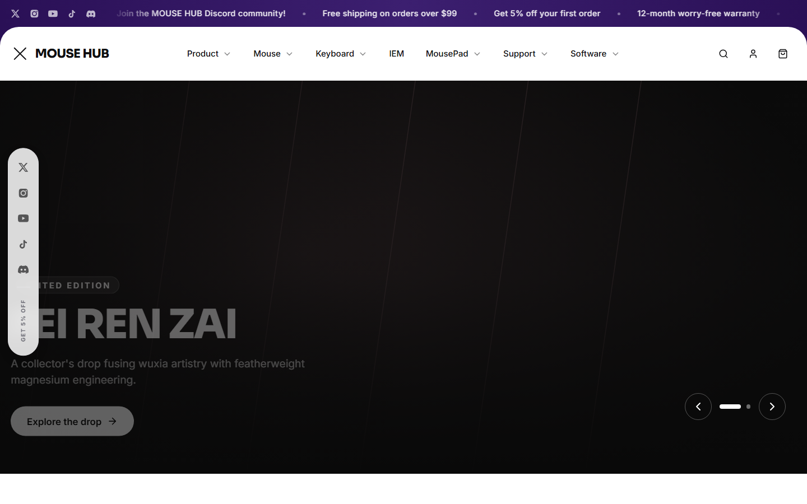
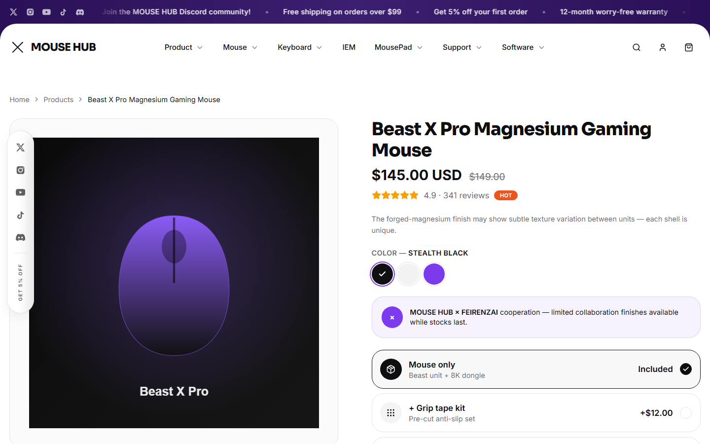
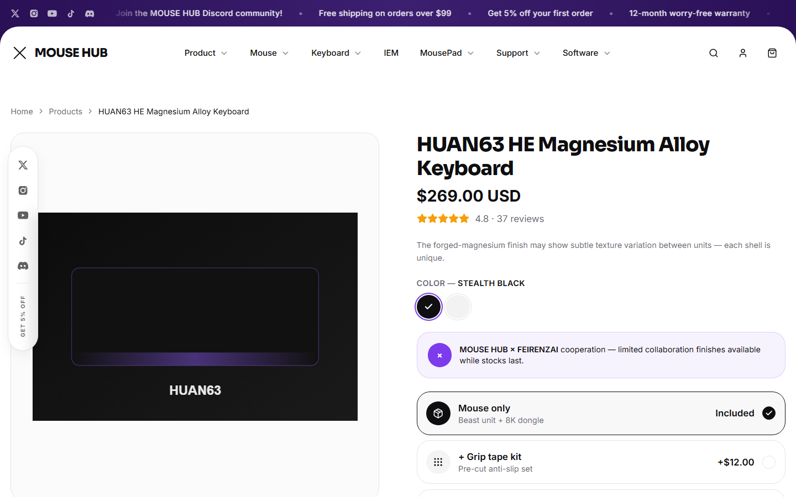

# MOUSE HUB — Gaming Peripherals Storefront

A front-end e-commerce storefront demo built with Next.js — a modern gaming-gear shop (product catalog, PDP, cart, search, account) with careful attention to layout, motion and micro-interactions.

## Screenshots

| Home | Product page | Keyboard page |
| --- | --- | --- |
|  |  |  |

## Features

- **Full storefront UI** — announcement bar, mega-menu header, side social rail, footer, mobile menu
- **Product catalog** — mice, Hall-effect keyboards and mousepads with dynamic `/products/[slug]` pages, color variants, add-ons and pricing
- **Cart** — slide-out drawer cart with persisted state (Zustand)
- **Search overlay, quick-view modal, account modal and a mocked support-chat widget**
- **Recently viewed** products tracking
- Built with the App Router, animated with Framer Motion, styled with Tailwind CSS + shadcn/ui primitives

## Tech stack

- [Next.js 14](https://nextjs.org/) (App Router) + TypeScript
- [Tailwind CSS](https://tailwindcss.com/) + [tailwind-merge](https://github.com/dcastil/tailwind-merge) / `class-variance-authority`
- [Zustand](https://github.com/pmndrs/zustand) for cart / auth / UI / recently-viewed state
- [Framer Motion](https://www.framer.com/motion/) for transitions and micro-interactions
- [Radix UI](https://www.radix-ui.com/) primitives (dialog, slot) via shadcn/ui
- [lucide-react](https://lucide.dev/) icons

## Project structure

```
app/                 # App Router routes (home, products/[slug], cart, account)
components/
  home/              # Homepage sections (hero, collection grid, showcases, ...)
  layout/            # Header, footer, side rail, drawers, modals, mobile menu
  product/           # PDP building blocks, quick-view modal
  shared/ & ui/       # Reusable UI primitives
hooks/               # Custom hooks
lib/                 # Product/order data, constants, utils
store/               # Zustand stores (auth, cart, ui, recently-viewed)
types/               # Shared TypeScript types
```

## Getting started

```bash
npm install
npm run dev
```

Open [http://localhost:3000](http://localhost:3000).

```bash
npm run build   # production build
npm run start   # run the production build
npm run lint    # eslint
```

## Note

This is a demo/portfolio project — all products, pricing, orders and accounts are mocked; there is no real backend or checkout. Product imagery is original placeholder art generated for this project, not real photography.

## License

All rights reserved — see [LICENSE](LICENSE). This code is shared publicly for portfolio review only; it is not licensed for reuse, redistribution, or reproduction without permission.
