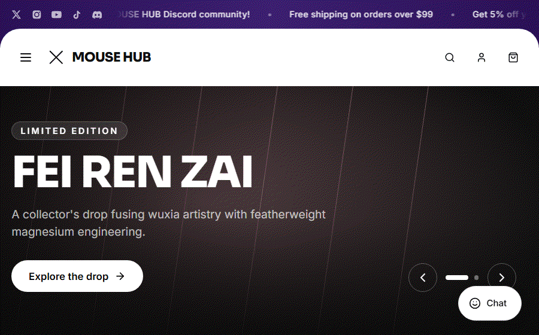

# MOUSE HUB — витрина магазина игровой периферии

Демо интернет-магазина на Next.js — современный магазин игровой периферии (каталог товаров, страница товара, корзина, поиск, личный кабинет) с проработкой вёрстки, анимаций и микро-взаимодействий.

## Демо



## Возможности

- **Полноценный UI витрины** — плашка с анонсами, шапка с мега-меню, боковая панель соцсетей, футер, мобильное меню
- **Каталог товаров** — мыши, Hall-effect клавиатуры и коврики с динамическими страницами `/products/[slug]`, вариантами цвета, допами и ценами
- **Корзина** — выезжающий дроуэр корзины с сохранением состояния (Zustand)
- **Оверлей поиска, быстрый просмотр товара, модалка аккаунта и имитация чата поддержки**
- **История просмотров** товаров
- Собрано на App Router, анимации на Framer Motion, стили на Tailwind CSS + примитивы shadcn/ui

## Стек

- [Next.js 14](https://nextjs.org/) (App Router) + TypeScript
- [Tailwind CSS](https://tailwindcss.com/) + [tailwind-merge](https://github.com/dcastil/tailwind-merge) / `class-variance-authority`
- [Zustand](https://github.com/pmndrs/zustand) для состояния корзины / авторизации / UI / истории просмотров
- [Framer Motion](https://www.framer.com/motion/) для переходов и микро-анимаций
- [Radix UI](https://www.radix-ui.com/) примитивы (dialog, slot) через shadcn/ui
- [lucide-react](https://lucide.dev/) иконки

## Структура проекта

```
app/                 # Роуты App Router (главная, products/[slug], cart, account)
components/
  home/              # Секции главной страницы (hero, витрина серий, showcase, ...)
  layout/            # Шапка, футер, боковая панель, дроуэры, модалки, мобильное меню
  product/           # Блоки страницы товара, модалка быстрого просмотра
  shared/ & ui/       # Переиспользуемые UI-примитивы
hooks/               # Кастомные хуки
lib/                 # Данные товаров/заказов, константы, утилиты
store/               # Zustand-сторы (auth, cart, ui, recently-viewed)
types/               # Общие типы TypeScript
```

## Запуск

```bash
npm install
npm run dev
```

Открыть [http://localhost:3000](http://localhost:3000).

```bash
npm run build   # прод-сборка
npm run start   # запуск прод-сборки
npm run lint    # eslint
```

## Примечание

Это демо/портфолио-проект — все товары, цены, заказы и аккаунты вымышленные, реального бэкенда и оформления заказа нет. Изображения товаров — оригинальная сгенерированная графика-плейсхолдер, а не реальные фотографии.

## Лицензия

Все права защищены — см. [LICENSE](LICENSE). Код опубликован только для портфолио-обзора; использование, распространение или копирование без разрешения не допускается.
